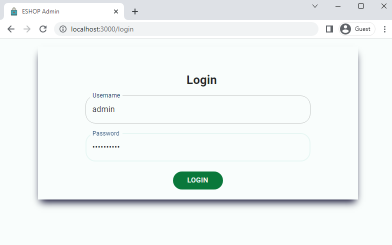

<!-- GETTING STARTED -->
<a name="readme-top"></a>

## About
Manage online shopping app with this admin app which has dashboard that displays user statistics, features to add/manage products and many more.

<p align="center">
  <h3> Admin UI </h3>
  <div style="display:flex; align-items: center;">
  
  
  
  
  
  
  
  
  
  </div>
</p>

## Getting Started

Set up this project locally and get it up and running by following these steps.


### Prerequisites

* npm
  ```sh
  npm install npm@latest -g
  ```
* Setup backend repository
    * setup backend and connect to the mongodb database by following steps in [eshop-backend repository](https://github.com/anushashettyj/eshop-backend)
  

### Installation

Install and set up this app as given below.

1. Clone the repo
   ```sh
   git clone https://github.com/anushashettyj/eshop-admin.git
   ```
2. Install NPM packages
   ```sh
   npm install
   ```
3. Bring up the app
   ```js
   npm start
   ```
      * Runs the app in the development mode
      * Open [http://localhost:3000](http://localhost:3000) to view the app in your browser.
      * Create admin account and perform CRUD operation on Users and Products available in the UI.

<!-- ROADMAP -->
## Roadmap

- [ ] Enhance UI and responsiveness
- [ ] Add transactions feature to manage orders
- [ ] Improve theme for dark and light mode
- [ ] Complete sales page
- [ ] Add User profile and settings feature
- [ ] Add automated Test cases


<!-- CONTACT -->
## Contact

Anusha Shetty - [Linkedin](https://www.linkedin.com/in/anusha-shetty-17a97589)

Project Link: [https://github.com/anushashettyj/eshop-admin](https://github.com/anushashettyj/eshop-admin)

<p align="right">(<a href="#readme-top">back to top</a>)</p>
